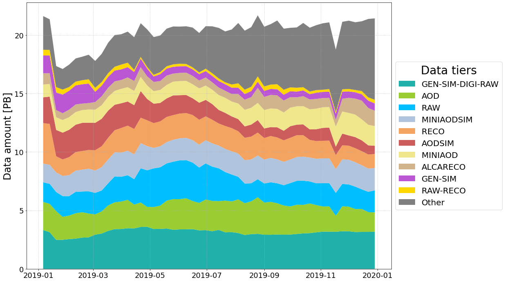

# CMS computing model - Data Analytics


## Introduction
Computing operations at the Large Hadron Collider (LHC) at CERN rely on the Worldwide LHC Computing Grid (WLCG) infrastructure, designed to efficiently allow storage, access, and processing of data at the pre-exascale level.

A close and detailed study of the exploited computing systems for the LHC physics mission represents an increasingly crucial aspect in the roadmap of High Energy Physics (HEP) towards the exascale regime.\
A deep knowledge of these systems will be essential to effectively express the discovery potential of LHC in the High Luminosity phase, which is estimated to collect up to 30 times more data than LHC in the next few years, and with novel part of the detectors which also adds large complexities to the overall picture.

In this context, the Compact Muon Solenoid (CMS) experiment has been collecting and storing over the last years a large set of heterogeneous non-collision-data (e.g. meta-data about data placement choices, transfer operations, and actual user access to physics datasets): all this data richness is currently residing on a **distributed Hadoop cluster**, and the data is organized so that running fast and arbitrary queries using the **Spark analytics framework** is a viable approach for focussed big data mining efforts.

CMS relies on its **Monte Carlo Management** (MCM) system, a tool to collect and monitor all Monte Carlo sample requests, namely a system that can be used to gain access to additional information about the simulated datasets produced for physics analysis.

Exploiting these sources, and using a data-driven approach oriented to the analysis of the aforementioned meta-data, we started to focus on data storage and data transfers over the WLCG infrastructure, and drafted an embrional software toolkit that can provide useful indicators about recurrent patterns and their correlations, for a deeper and more accurate exploration of the CMS computing beating heart in terms data movement and access.\
This aims – as a short-to-medium term goal – at exploring the effectiveness and adequateness of various choices in a data lake context, and – as a long term goal – at contributing to the overall design of a predictive/adaptive system that would eventually reduce cost and complexity of the CMS computing operations, while taking into account the stringent requests and the boundary conditions set by the physics analysts community.

#

## Installation
To install the toolkit, you can simply clone the repository and run the `setup.py` installer.

```bash
git clone https://github.com/SimoneGasperini/cms-cmSim.git
cd cms-cmSim
python setup.py install
```

#

## Usage example
As an example, let's suppose you want to know how much data is stored on disk in a specific site (e.g. `T1_FNAL` in the `US`) in a particular year (e.g. 2019), grouping the data by a custom list of data tiers.

```python
import pandas as pd
import pylab as plt
from cmSim.site import Site

# load dataframe from local parquet file
df = pd.read_parquet('<filepath>/dataset_site_info.parquet')

# create Site object from dataframe
site = Site.from_dataframe(df, name='T1_US_FNAL_Disk')

# set custom list of data tiers
datatiers = ['RAW', 'RECO', 'AOD', 'MINIAOD', 'AODSIM', 'MINIAODSIM',
             'RAW-RECO', 'GEN-SIM', 'GEN-SIM-DIGI-RAW', 'ALCARECO']

# plot history of data stored on disk grouped by datatier
fig, ax = plt.subplots(figsize=(16, 12))
site.plot_storage_history_by_datatier(ax, datatiers=datatiers,
                                      date1='2019-1-1', date2='2019-12-31',
                                      freq='W', norm=False)
```


#

## Repository structure
- `cmSim\` 🠊 main directory containing the core modules implementing classes to be used for data analytics, together with general configurations and additional tools;

    * `cmSim\config\` 🠊 contains JSON files to handle the toolkit configurations and settings (e.g. data tiers or PWG colors);

    * `cmSim\tools\` 🠊 contains additional code implementing some basic functionalities related to the project (e.g. zipping JSON files);

- `notebooks\` 🠊 contains jupyter notebooks as working examples about how to use the toolkit but also to start exploring the data;

- `scripts\` 🠊 contains scripts to perform specific tasks (e.g. data pre-processing).

```
.
├── cmSim\
│   ├── config\
|   |   ├── countries.json
|   |   ├── datalakes.json
|   |   └── ...
│   ├── tools\
|   |   ├── mcm_rest.py
|   |   ├── multithread.py
|   |   └── ...
|   ├── utils.py
|   └── ...
├── notebooks\
|   └── ...
├── scripts\
|   └── ...
├── .gitignore
├── README.md
├── requirements.txt
└── setup.py
```

#
## External links
### 🠊 CMS monitoring data available: [CMS-cmSim/data/](https://liveunibo-my.sharepoint.com/:f:/g/personal/simone_gasperini2_studio_unibo_it/Eh5PN28-dPxMk8k6xOKacHsBAtPoEHkqk03jwOgqshaB5A?e=0CBqhg)

### 🠊 CMS monitoring project dashboard: [CMS-MONIT](https://monit-grafana.cern.ch/d/000000530/cms-monitoring-project?orgId=11)

### 🠊 Presentation at "ISGC 2022, Taiwan": [CMS-cmSim/ISGC_2022.pdf](https://liveunibo-my.sharepoint.com/:b:/g/personal/simone_gasperini2_studio_unibo_it/EdpRYSr3AbFCrnrAy1vt-xcBbXt0Cg75GZjzd1jkvu1hOw?e=GROqMc)

#

<p align="right"> Simone Gasperini - simone.gasperini@cern.ch</p>
