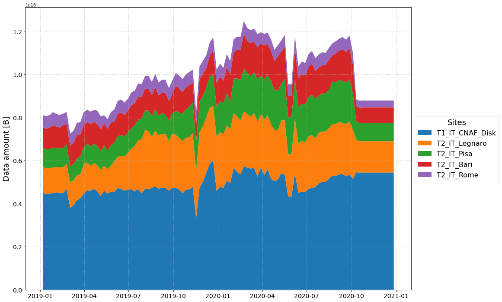
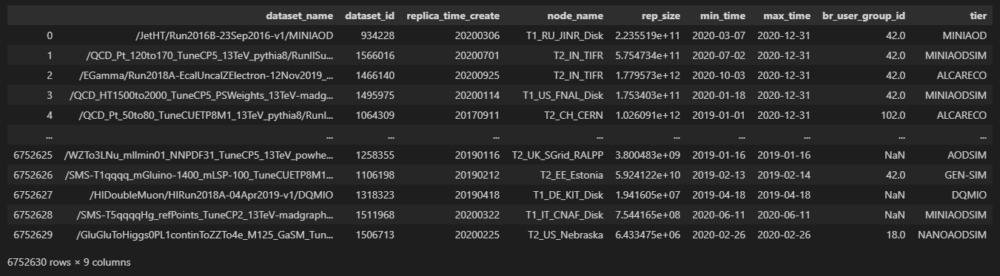
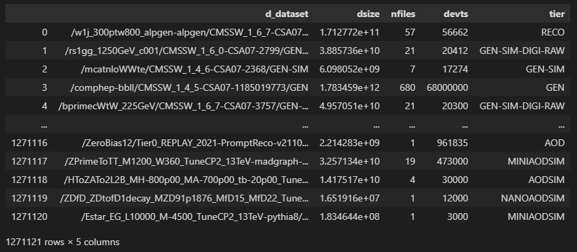
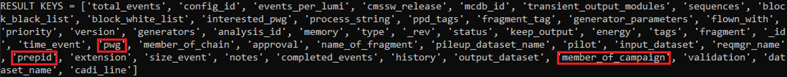

# CMS computing model - Analysis and Simulation

## Table of contents:
- ### [_Introduction](#introduction)
- ### [_Installation](#installation)
- ### [_Usage example](#usage-example)
- ### [_Repository structure](#repository-structure)
- ### [_Data structure](#data-structure)

 ### _______________________________________Link to data on _OneDrive_: 🠊 [CMS-cmSim/data](https://liveunibo-my.sharepoint.com/:f:/g/personal/simone_gasperini2_studio_unibo_it/Eh5PN28-dPxMk8k6xOKacHsBAtPoEHkqk03jwOgqshaB5A?e=0CBqhg) 🠈


## Introduction
In High Energy Physics (HEP) research, software and computing systems are designed to store and manage a **huge amount of data** every day and they perform **computationally intensive analysis** over a large, heterogenous, and geographically distributed grid.

The modernization of these system represents an increasingly crucial aspect in HEP. In particular, to meet the High-Luminosity LHC (HL-LHC) challenges, the design, efficiency, and robustness of the computing systems is the key to fully realize the discovery potential of accelerator machines or other experiments.

The analysis and the simulation of these computing systems (according to approaches similar to the industrial "digital twin") can make easier for the HEP community to evaluate the impact of possible future technical upgrades, study different scenarios and their implications, highlight the best choices to take as well as any weakness that can be previously addressed by appropriate mitigation techniques.\
Furthermore, given the data available from the monitoring systems of LHC experiments deriving from large-scale operations carried out in recent years, it is now possible to have a fertile ground for the use of big data analytics tools as well as machine learning (ML) techniques which can help to implement more predictive and adaptive simulations.

This project is focussed on infrastructural aspects of **data storage** and **data transfer** for the CMS experiment computing model, trying also to explore the "data lake" architecture solution.
In particular, the project aims to draft a preliminary software toolkit that will allow to pave this way for CMS.


## Installation
To install this toolkit, simply clone the repository and run the `setup.py` installer.

```bash
git clone https://github.com/SimoneGasperini/cms-cmSim.git
cd cms-cmSim
python setup.py install
```


## Usage example
As an example about how to use the toolkit, suppose you want to investigate about how much data is stored in a specific country (e.g. `Italy`) over time (e.g. from `2019-1-1` to `2020-12-31`), grouping data by all the different sites in that country.

```python
import pandas as pd
from cmSim.site import Site

# loading dataframe from local parquet file
df = pd.read_parquet('<FILEPATH>/dataset_site_info.parquet')

# creating Site object from dataframe
site = Site.from_dataframe(df, name='T1_IT_CNAF_Disk')
```

```python
import pylab as plt

fig, ax = plt.subplots(figsize=(16, 12))

# plotting history of data stored on disk grouped by datatier
datatiers = ['RAW', 'RECO', 'AOD', 'MINIAOD', 'AODSIM', 'MINIAODSIM']
site.plot_storage_history_by_datatier(ax, datatiers=datatiers, norm=True)
```



## Repository structure
The repository structure is the following:

- `cmSim\` 🠊 it is the main directory containing the source code (e.g. all the modules implementing classes used in data analysis and model simulation) together with general configurations and additional tools;

    * `config\` 🠊 it contains the JSON files to handle the toolkit configurations and settings (e.g. choose the colors for plotting data belonging to different data-tiers/working groups, ...);

    * `tools\` 🠊 it contains the additional tools implemented to perform some specific tasks related to the project (e.g. perform parallel HTTP requests to the CMS Monte Carlo Management system using multithreading, ...);

- `images\` 🠊 it simply contains the images displayed in README file or other kind of documentation;

- `notebooks\` 🠊 it contains useful notebooks as working examples about how to use the toolkit but also to start exploring the data;

- `scripts\` 🠊 it contains several ready-to-run scripts to perform specific tasks (e.g. split the big PARQUET in smaller files easier to be read, ...).

```
.
├── cmSim\
│       ├── config\
|       |       ├── countries.json
|       |       ├── datalakes.json
|       |       └── ...
│       ├── tools\
|       |       ├── mcm_rest.py
|       |       ├── multithread.py
|       |       └── ...
|       ├── utils.py
|       └── ...
├── images\
|       └── ...
├── notebooks\
|       └── ...
├── scripts\
|       └── ...
├── .gitignore
├── README.md
├── requirements.txt
└── setup.py
```


## Data structure
All the data Several types of data structured in differernt ways are available:

1) `dataset_site_info.parquet` contains the history about datasets stored on disk over the grid from the beginning of 2019 to the end of 2020. In particular, the dataframe columns structure is the following:
    * "**dataset_name**": full name of the whole dataset
    * "**dataset_id**": unique ID of the whole dataset
    * "**replica_time_create**": creation date of the replica from the corresponding entire dataset
    * "**node_name**": site (including tier and country) where the replica is stored
    * "**rep_size**": replica size (in Bytes)
    * from "**min_time**" to "**max_time**": time interval during which the replica is stored on disk in that site
    * "**br_user_group_id**": ???
    * "**tier**": dataset data-tier

    

    Since this file is quiet big, smaller PARQUET have been created filtering for each generated file only data belonging to specific data-tiers (_RAW_, _RECO_, _AOD/AODSIM_, _MINIAOD/MINIAODSIM_, _NANOAOD/NANOAODSIM_).\
    The script written to do this job is available in the repository: [scripts\split_parquet_file.py](https://github.com/SimoneGasperini/cms-cmSim/blob/master/scripts/split_parquet_file.py). The resulting files are named `<DATATIER>_data_history.parquet`.

2) `dataset_size_info.parquet` consists in a list of all the CMS datasets (from about 2007/2008 to 2020) providing general information about each one. In particular, the dataframe columns structure is the following:
    * "**d_dataset**": dataset full name
    * "**dsize**": dataset full size (in Bytes)
    * "**nfiles**": number of distinct files in which the dataset is splitted
    * "**devts**": number of events in the dataset
    * "**tier**": dataset data-tier

    

3) `<DATATIER>_mcm_data.json` are a set of zipped JSON files containing infomation available only for simulated data (e.g. _AODSIM_, _MINIAODSIM_, _NANOAODSIM_, ...).
This data has been downloaded from the CMS Monte Carlo Management (MCM) system by calling the _GET_ public API method:
    * `public/restapi/requests/produces/<DATASET_NAME>`

    where `DATASET_NAME` is the full name of the (produced) dataset (see [MCM Public](https://cms-pdmv.cern.ch/mcm/public/restapi/requests)).

    The result of each query to MCM contains a lot of information for each dataset (including for instance the Physics Working Group):

    

    As a complete example of HTTP request to MCM, see the following link:\
    https://cms-pdmv.cern.ch/mcm/public/restapi/requests/produces/SingleElectronPt35/Summer12_DR53X-PU_S10_START53_V7A-v1/AODSIM

    The script written to download all the data for a selected data-tier and save the result in a zipped JSON file is available in the repository: [scripts/dump_mcm_data.py](https://github.com/SimoneGasperini/cms-cmSim/blob/master/scripts/dump_mcm_data.py).
