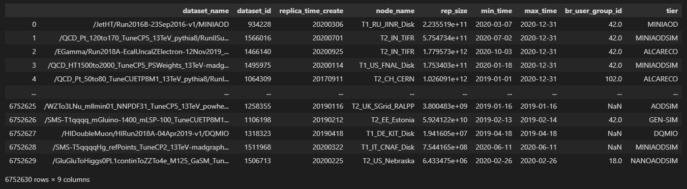

# CMS Computing Model analysis and simulation

## Table of contents:
- ### [Introduction](#introduction)
- ### [Installation](#toolkit-installation)
- ### [Usage example](#usage-example)


## Introduction
In High Energy Physics (HEP) research, software and computing systems are designed to store and manage a **huge amount of data** every day and they perform **computationally intensive analysis** over a large, heterogenous, and geographically distributed grid.

The modernization of these system represents an increasingly crucial aspect in HEP. In particular, to meet the High-Luminosity LHC (HL-LHC) challenges, the design, efficiency, and robustness of the computing systems is the key to fully realize the discovery potential of accelerator machines or other experiments.

The analysis and the simulation of these computing systems (according to approaches similar to the industrial "digital twin") can make easier for the HEP community to evaluate the impact of possible future technical upgrades, study different scenarios and their implications, highlight the best choices to take as well as any weakness that can be previously addressed by appropriate mitigation techniques.\
Furthermore, given the data available from the monitoring systems of LHC experiments deriving from large-scale operations carried out in recent years, it is now possible to have a fertile ground for the use of big data analytics tools as well as machine learning (ML) techniques which can help to implement more predictive and adaptive simulations.

This project is focussed on infrastructural aspects of **data storage** and **data transfer** for the CMS experiment computing model, trying also to explore the "data lake" architecture solution.
In particular, the project aims to draft a preliminary software toolkit that will allow to pave this way for CMS.


## Installation
To install this toolkit, simply clone the repository and run the `setup.py` installer.

```bash
git clone https://github.com/SimoneGasperini/cms-cmSim.git
cd cms-cmSim
python setup.py install
```


## Usage example
As an example about how to use the toolkit, suppose you want to investigate about how much data is stored in a specific country (e.g. `Italy`) over time (e.g. from `2019-1-1` to `2020-12-31`), grouping data by all the different sites in that country.

```python
import pandas as pd

# reading data from parquet file
df = pd.read_parquet('dataset_site_info.parquet')
df.head(None)
```


```python
from cmSim.country import Country

# creating Country object from dataframe
country = Country.from_dataframe(name='Italy', df=df)

print('country =', country)
print('T1s =', country.t1_sites)
print('T2s =', country.t2_sites)
```
`country = Country(name=Italy, code=IT, #T1s=1, #T2s=4)`\
`T1s = ['T1_IT_CNAF_Disk']`\
`T2s = ['T2_IT_Rome', 'T2_IT_Bari', 'T2_IT_Pisa', 'T2_IT_Legnaro']`

```python
import pylab as plt

# plotting history of data stored on disk (grouped by site)
fig, ax = plt.subplots(figsize=(16, 12))
country.plot_storage_history_by_site(ax, norm=False)
```

